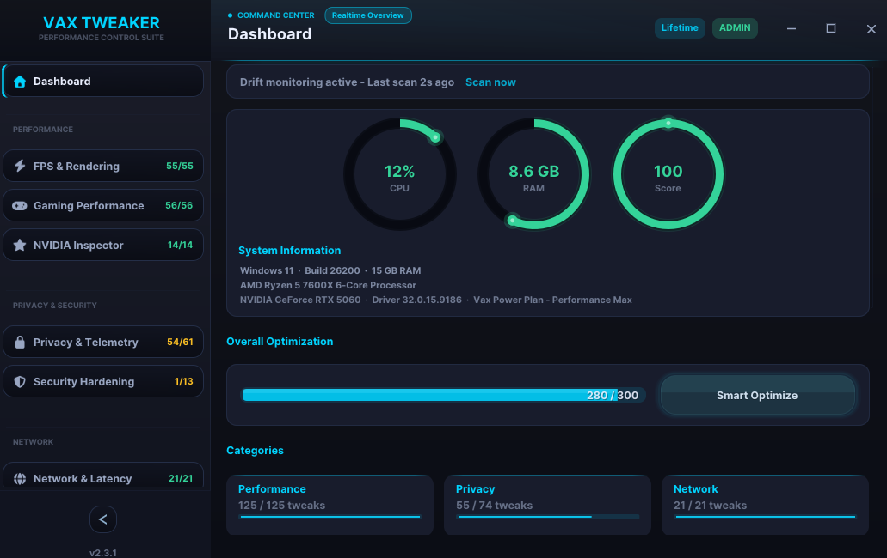

# ⚡ VAX TWEAKER

### Ultimate Windows System Optimizer

**A professional-grade system optimization suite built in C++.**
Designed for gamers, power users, and IT professionals who demand peak performance.

 

 
 

---

## 🎯 What is VAX TWEAKER?

VAX TWEAKER is a lightweight, native C++ application that optimizes Windows 10/11 systems through carefully curated registry tweaks, service management, and system configuration adjustments.

Unlike bloated "optimizer" software, VAX TWEAKER:
- **Runs entirely offline** — no telemetry, no accounts, no internet required
- **Modifies only what you approve** — every tweak requires explicit confirmation
- **Backs up everything automatically** — every change can be reverted instantly
- **Is a single portable executable** — no installation, no dependencies

---

## 📦 Modules — 276 Tweaks

| # | Module | Tweaks | Description |
|---|--------|:------:|-------------|
| ⚡ | **FPS & Rendering** | 39 | Fullscreen optimizations, GPU scheduling, visual effects, Game Bar/DVR, DWM compositor, MPO, transparency, power plans |
| 🎮 | **Gaming Performance** | 32 | CPU priority, system timers, HPET/TSC, MMCSS, timer resolution, third-party service disabling, memory management |
| 🖥️ | **NVIDIA Inspector** | 9 | GPU driver-level optimizations — shader cache, power management, threaded optimization, texture filtering, CUDA |
| 🌐 | **Network Optimization** | 35 | Nagle's algorithm, TCP tuning, DNS config, NIC adapter, timestamps, heuristics, ECN, window scaling, NetBIOS |
| 🔒 | **Privacy & Telemetry** | 62 | 10 groups — telemetry, Cortana/Copilot/Recall, activity sync, device permissions, app data access, sensors, NVIDIA/VS/Edge/Office telemetry |
| 🛡️ | **Security Hardening** | 13 | RDP, SMBv1, admin shares, UAC, WDigest, AutoRun, PowerShell v2, Edge/Chrome/Firefox browser security policies |
| 🧹 | **Windows Debloater** | 31 | 7 groups — taskbar UI, Start tips, UWP removal, scheduled tasks, Windows Update controls, Insider/experiments, compatibility |
| 🧽 | **System Cleaner** | 33 | Temp files, prefetch, thumbnails, browser caches (Chrome/Edge/Firefox), Steam, NVIDIA/AMD, Office, Teams, Discord, DNS flush |
| ⚙️ | **Service Manager** | 18 | Disable unnecessary Windows services — Xbox, Maps, Retail Demo, Contact Data, diagnostics services |
| 📊 | **System Analysis** | — | Full hardware/software diagnostic scan — CPU, GPU, RAM, drivers, runtimes, network adapters, OS build |
| 📈 | **System Monitor** | — | Real-time CPU, RAM, and disk usage monitoring with live-updating console dashboard |
| 🎯 | **Game Profiles** | — | Save and load per-game optimization profiles — apply/revert tweak sets with one click |

---

## 🛡️ Safety & Restore

VAX TWEAKER is engineered with safety as the top priority:

| Feature | Description |
|---------|-------------|
| 🔄 **Automatic Backup** | Every registry change is backed up before modification — stored in `%APPDATA%\VaxTweaker` |
| 💾 **Crash Recovery** | Backup file persisted to disk after each operation with CRC32 integrity verification |
| ⏪ **One-Click Restore** | Restore all changes at any time from the main menu — reverse order, atomic operations |
| ⚠️ **Risk Classification** | Every tweak is labeled: `SAFE` · `MODERATE` · `ADVANCED` · `RISKY` |
| ✅ **Confirmation Prompts** | Detailed warning shown before every operation — name, description, risk level, reboot notice |
| 🖥️ **System Restore Point** | Offered at startup before any modifications — with automatic System Protection enablement |
| 🔍 **Compatibility Engine** | Detects laptop/desktop, Modern Standby, OS build, GPU driver — warns about risky combinations |
| 📝 **Full Logging** | Every operation is timestamped and logged — exportable crash log on fatal errors |

---

## 💻 System Requirements

| Requirement | Minimum |
|-------------|---------|
| **OS** | Windows 10 (build 10240+) or Windows 11 |
| **Architecture** | x64 |
| **Privileges** | Administrator recommended (required for HKLM tweaks) |
| **Disk Space** | < 2 MB |
| **Dependencies** | None — single portable `.exe` |

---

## 🚀 Quick Start

1. **Download** `VaxTweaker.exe` from [Releases](https://github.com/vaxead/vax-tweaker/releases)
2. **Right-click → Run as Administrator** for full functionality
3. **Accept the disclaimer** (shown only on first launch)
4. **Create a System Restore Point** when prompted
5. **Select a module** and start optimizing

> **Tip:** You can run without admin — HKCU tweaks will work, but HKLM tweaks will be skipped with a clear warning.

---

## 📸 Screenshots

 
Main menu — Admin mode, Windows 11 (Build 26200)

---

## ❓ FAQ

<b>Is this safe? Can it cause a Blue Screen?</b>

 
No. VAX TWEAKER operates entirely in user-mode — it modifies registry values, services, and power configurations through standard Windows APIs. It cannot cause a BSOD. Every change is backed up and can be restored with one click.

<b>Do I need to install it?</b>

 
No. VAX TWEAKER is a single portable executable. Download it, run it, done. No installation, no registry pollution from the app itself.

<b>What if I want to undo everything?</b>

 
Press <code>[R] Restore All Changes</code> from the main menu. Every modification made during any session is tracked and can be reversed in one step. The backup file survives crashes and reboots.

<b>Does it work on Windows 10?</b>

 
Yes. VAX TWEAKER supports both Windows 10 and 11. The compatibility engine automatically detects your OS build and warns if a tweak targets features not available on your version.

<b>Is the source code available?</b>

 
VAX TWEAKER is proprietary software. The source code is not publicly available. This repository serves as the official distribution channel for releases, documentation, and issue tracking.

<b>How is this different from other tweakers?</b>

 

- **Native C++** — no .NET runtime, no Python, no Electron. Sub-second startup.
- **Data-driven architecture** — tweaks are declared as metadata, not hardcoded logic. This makes them auditable and consistent.
- **Automatic backup with integrity verification** — CRC32-protected backup files with atomic writes.
- **Compatibility engine** — proactive warnings based on your actual hardware and OS.
- **No telemetry** — zero network calls. Ever.

---

## 📋 Changelog

### v2.0.0 — Major Update
- **276 total tweaks** across **12 modules** (+30 new tweaks, +3 new modules)
- **Privacy**: 62 tweaks in 10 groups — new Extended Telemetry Controls, Sensor & Location, Third-Party Telemetry (NVIDIA, VS, Edge, Office)
- **Privacy**: Full ConsentStore coverage — Videos, Email, Tasks, Messaging, Broad Filesystem, Motion Data
- **Debloater**: 31 tweaks in 7 groups — new Windows Update Controls, Insider/Experiments, Compatibility & Diagnostics
- **Security**: 13 tweaks in 3 groups — new Browser Security group (Edge hardening, Chrome Reporter, Firefox Agent)
- **New module**: NVIDIA Inspector — 9 GPU driver-level tweaks via registry
- **New module**: Service Manager — 18 toggleable Windows services
- **New module**: System Monitor — real-time CPU/RAM/Disk dashboard
- **New module**: Game Profiles — per-game tweak presets
- **Machine-bound licensing** — HWID + DPAPI + Gumroad uses counter (1 key = 1 device)
- All tweaks fully reversible with data-driven apply/revert/status detection

### v1.0.0 — Initial Release
- 9 optimization modules with 200+ tweaks
- Automatic registry backup with CRC32 integrity verification
- System Restore Point integration
- Compatibility engine with laptop/Modern Standby detection
- System Cleaner with 33 cleaning targets
- Security Hardening module
- Full System Analysis diagnostic scanner

---

## ⚖️ License

**VAX TWEAKER** is proprietary software.
Copyright © 2025 [Vaxead](https://github.com/vaxead). All rights reserved.

This software is provided "as is" without warranty of any kind. Use entirely at your own risk.
See [LICENSE](LICENSE) for full terms.

---

**Built with ❤️ and C++ by [Vaxead](https://github.com/vaxead)**

⭐ Star this repo if you find VAX TWEAKER useful

